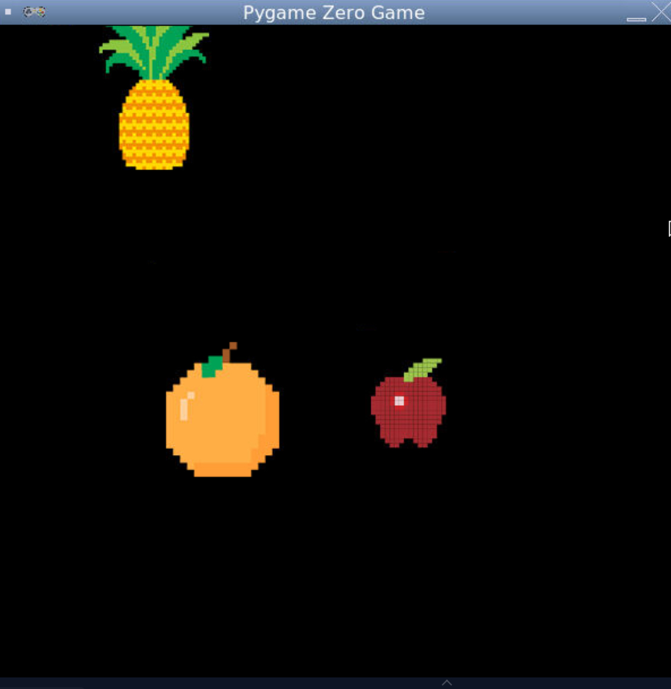
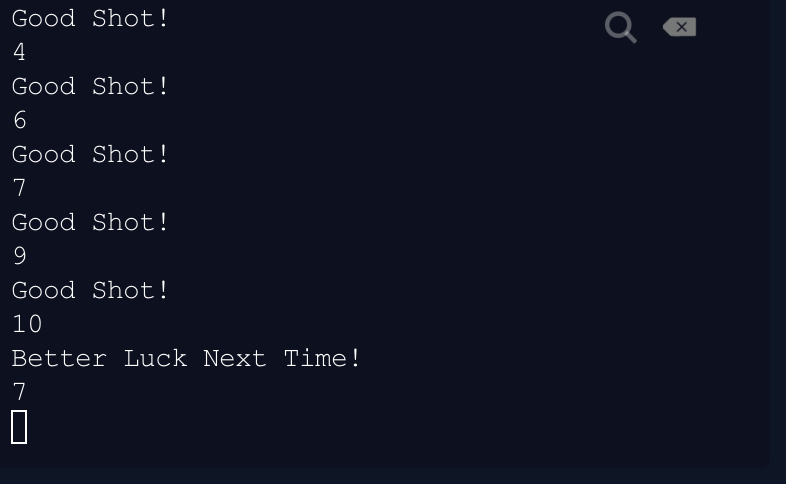

# Shoot the Fruit

___ 

This is my favorite game i've ever made, its simple, but its fun.

___

### Demo -

### Output via console -

___

### How to play -
- Apples give +1 points
- Pineapples give +2 points 
- Oranges give -3 points

___

### Play!

iFrame not loading? Click [here](https://repl.it/@CoolCoderSJ/Shoot-the-Fruit?lite=true&outputonly=1)

<iframe height="1000px" width="100%" src="https://repl.it/@CoolCoderSJ/Shoot-the-Fruit?lite=true&outputonly=1" scrolling="no" frameborder="no" allowtransparency="true" allowfullscreen="true" sandbox="allow-forms allow-pointer-lock allow-popups allow-same-origin allow-scripts allow-modals"></iframe>
